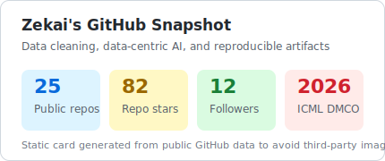
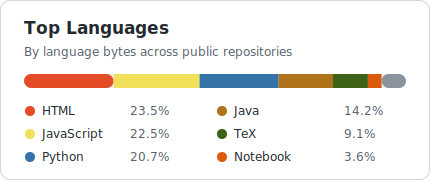

# Hi, I'm Zekai Qian :wave:

> Ph.D. student at Harbin Institute of Technology. I spend a suspicious amount of time convincing messy tables to behave.

  
  
  
  
  
  

## :sparkles: About Me, Less Officially

- :mortar_board: Now doing my Ph.D. at HIT, still mostly living inside **data-centric AI** and **data cleaning**.
- :test_tube: Research playground: dirty tables, data quality, cleaning decisions, AutoML under budget, and agentic data preparation.
- :hammer_and_wrench: I like building artifacts that actually run: scripts, cached results, demos, traces, and baseline runners.
- :badminton: Outside research, I still keep the old README spirit: fitness, badminton, movies, and occasionally pretending my experiments will finish before midnight.

  
  

## :compass: What I'm Working On

| Name | Short Version |
| --- | --- |
| [DemandPrep](https://github.com/qzkinhit/DemandPrep-artifact) | A demand-driven data preparation agent that decides when to preserve, repair, replace, delete, or roll back. |
| [DemandClean](https://github.com/qzkinhit/DemandClean) | RL-style data cleaning: not every suspicious cell deserves the same intervention. |
| [UniClean Result](https://github.com/qzkinhit/UniClean-bench-Result) | Benchmark release with dirty data, cleaned outputs, logs, and baseline comparisons. |
| [MADClean](https://github.com/qzkinhit/MADClean) | Model-aware cleaning for improving SVM utility and data quality under cleaning cost constraints. |
| [MDCBaseline](https://github.com/qzkinhit/MDCBaseline) | A unified runner for classic data cleaning baselines. |

## :books: Papers I Keep Talking About

| Year | Venue | Work |
| --- | --- | --- |
| 2026 | ICML | [DMCO: Budget-Aware Co-Optimization of Data Cleaning and AutoML](https://icml.cc/virtual/2026/poster/64882) |
| 2025 | PVLDB | [DemandClean: A Multi-Objective Learning Framework for Balancing Model Tolerance to Data Authenticity and Diversity](https://doi.org/10.14778/3750601.3750666) |
| 2025 | PVLDB | [UniClean: A Scalable Data Cleaning Solution for Mixed Errors based on Unified Cleaners and Optimized Cleaning Workflow](https://doi.org/10.14778/3749646.3749681) |
| 2025 | ICDE | [UniClean: A Multi-Signal Fusion Pipeline for Optimizing Data Cleaning Workflow](https://doi.org/10.1109/ICDE65448.2025.00362) |
| 2025 | ICDE | [$t$DCDiscover: Mining Threshold Denial Constraints from Time Series Data](https://doi.org/10.1109/ICDE65448.2025.00193) |
| 2025 | ICDE | [CBAClean: A Comprehensive System for Recommending Data Cleaning Solutions Through Cost-Benefit Analysis in Data Quality Management](https://doi.org/10.1109/ICDE65448.2025.00371) |

## :toolbox: Daily Toolbox

  
  
  
  
  
  
  
  

## :thought_balloon: Small Research Beliefs

- A data cleaning system should know **what the downstream task actually needs**.
- A smart agent should still leave boring but useful things behind: logs, traces, configs, and reproducible scripts.
- "Clean everything" is a tempting sentence, not always a good decision.
